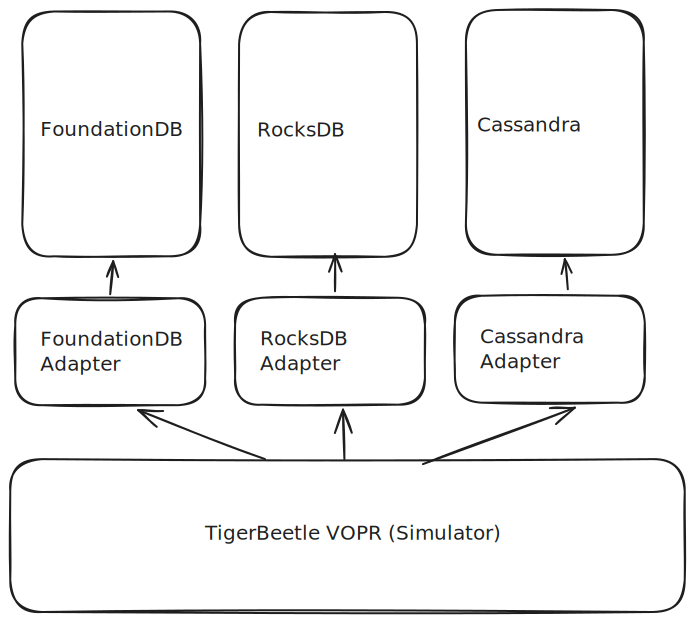

# FoundationDB, RocksDB Simulation Tester (FRoST)

FoundationDB is one of the progenitors of deterministic simulation testing
(DST). Here we evaluate DST as implemented by FoundationDB against a similar
DST implementation by TigerBeetleDB, and evaluate DST on other key-value
databases such as RocksDB, Cassandra and Valkey.

## Current development specifications

This repository uses the latest stable build of Zig 0.14.0, using
[Zig Version Manager (ZVM)](https://www.zvm.app/).

After installing ZVM, to download and use the latest stable build, `0.14.0`,
run:

```bash
zvm i 0.14.0 | zvm install 0.14.0
zvm use 0.14.0
```

You can build the simulator in debug spec with

```bash
zig build
```

and run the simulator with

```bash
./zig-out/bin/frost -h
```

to view available flags to set.

## Architecture

The architecture of FRoST is roughly defined by the diagram below:



## TODOs

- [x] Initialize development environment
- [x] Scratch standalone simulator based on TigerBeetle
      VOPR, PoC implementation
- [x] Implement Replica Resume after Pause during tick
- [x] Explore refactoring tick using for-loop vs while loop
- [ ] (IN PROGRESS: SHAOHONG) Evaluate FoundationDB simulator standalone:

      https://github.com/apple/foundationdb/tree/main/tests/TestRunner

      Evaluate rocksdb backend performance on dst. **Hanged**
      https://github.com/apple/foundationdb/pull/11790

- [ ] (IN PROGRESS: SHAOHONG) Evaluate RocksDB simulator standalone:

      https://github.com/facebook/rocksdb/wiki/Stress-test 
      RocksDB Simulator is served for stress tests on its caching mechanism, and 
      is not deterministic, nor able to simulate workloads in a shorter time scale. 
      Implementing a DST for such system may seem less meaningful. However, 
      rocksDB backend was supported by foundationdb in an update. This method 
      creates a threadpool for the rocksdb coroutine workflow. I wonder how this
      works and will look into it.
      https://forums.foundationdb.org/t/rocksdb-backend/845/9 
      
- [ ] (IN PROGRESS: SHAOHONG) Evaluate Cassandra simulator standalone:

      https://cassandra.apache.org/doc/stable/cassandra/tools/cassandra_stress.html
      https://cassandra.apache.org/_/blog/Testing-Apache-Cassandra-4.html
      
- [ ] Evaluate YCSB with/without TigerBeetle VOPR on FoundationDB
- [ ] Evaluate TigerBeetle VOPR on RocksDB
- [ ] Evaluate YCSB with/without TigerBeetle VOPR on RocksDB
- [ ] [Optional] Evaluate TigerBeetle VOPR on Cassandra
- [ ] [Optional] Evaluate YCSB with/without TigerBeetle VOPR on Cassandra
- [ ] [Optional] Evaluate TigerBeetle VOPR on Valkey
- [ ] [Optional] Evaluate YCSB with/without TigerBeetle VOPR on Valkey
- [ ] **DEADLINE: APR. 18** Final Report
- [ ] **DEADLINE: APR. 18** Final Presentation @9:30 (15 min)
